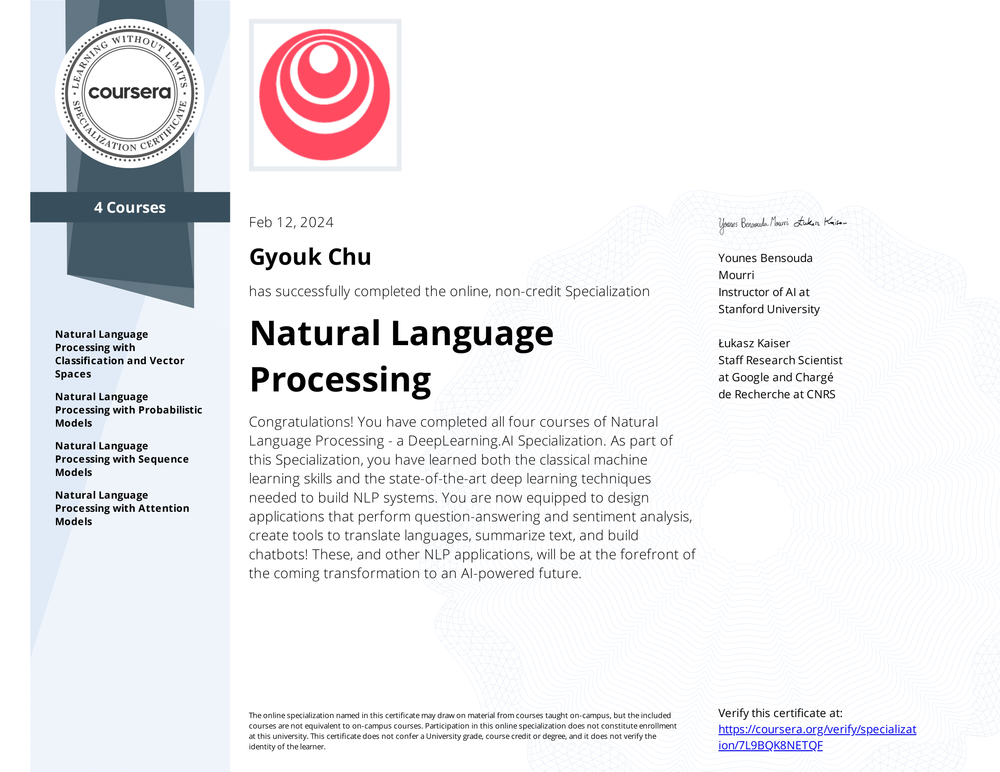

# NLP Specialization Certificate

# Natural Language Processing Specialization by Deeplearning.ai on Coursera

Natural Language Processing (NLP) is a subfield of linguistics, computer science, and artificial intelligence that uses algorithms to interpret and manipulate human language.

This technology is one of the most broadly applied areas of machine learning and is critical in effectively analyzing massive quantities of unstructured, text-heavy data. As AI continues to expand, so will the demand for professionals skilled at building models that analyze speech and language, uncover contextual patterns, and produce insights from text and audio.

By the end of this Specialization, you will be ready to design NLP applications that perform question-answering and sentiment analysis, create tools to translate languages and summarize text, and even build chatbots. These and other NLP applications are going to be at the forefront of the coming transformation to an AI-powered future.

This Specialization is designed and taught by two experts in NLP, machine learning, and deep learning. Younes Bensouda Mourri is an Instructor of AI at Stanford University who also helped build the Deep Learning Specialization.
Łukasz Kaiser is a Staff Research Scientist at Google Brain and the co-author of Tensorflow, the Tensor2Tensor and Trax libraries, and the Transformer paper.

Applied Learning Project

This Specialization will equip you with machine learning basics and state-of-the-art deep learning techniques needed to build cutting-edge NLP systems:

• Use logistic regression, naïve Bayes, and word vectors to implement sentiment analysis, complete analogies, translate words, and use locality-sensitive hashing to approximate nearest neighbors.

• Use dynamic programming, hidden Markov models, and word embeddings to autocorrect misspelled words, autocomplete partial sentences, and identify part-of-speech tags for words.

• Use dense and recurrent neural networks, LSTMs, GRUs, and Siamese networks in TensorFlow and Trax to perform advanced sentiment analysis, text generation, named entity recognition, and to identify duplicate questions.

• Use encoder-decoder, causal, and self-attention to perform advanced machine translation of complete sentences, text summarization, question-answering, and to build chatbots. Learn T5, BERT, transformer, reformer, and more with 🤗 Transformers!

## Course 1: Natural Language Processing with Classification and Vector Spaces

In Course 1 of the Natural Language Processing Specialization, you will:

a) Perform sentiment analysis of tweets using logistic regression and then naïve Bayes,
b) Use vector space models to discover relationships between words and use PCA to reduce the dimensionality of the vector space and visualize those relationships, and
c) Write a simple English to French translation algorithm using pre-computed word embeddings and locality-sensitive hashing to relate words via approximate k-nearest neighbor search.

By the end of this Specialization, you will have designed NLP applications that perform question-answering and sentiment analysis, created tools to translate languages and summarize text, and even built a chatbot!

This Specialization is designed and taught by two experts in NLP, machine learning, and deep learning. Younes Bensouda Mourri is an Instructor of AI at Stanford University who also helped build the Deep Learning Specialization. Łukasz Kaiser is a Staff Research Scientist at Google Brain and the co-author of Tensorflow, the Tensor2Tensor and Trax libraries, and the Transformer paper.

**Week 1: Sentiment Analysis with Logistic Regression**

- Learn to extract features from text into numerical vectors, then build a binary classifier for tweets using a logistic regression!

**Week 2: Sentiment Analysis with Naïve Bayes**

- Learn the theory behind Bayes' rule for conditional probabilities, then apply it toward building a Naïve Bayes tweet classifier of your own!

**Week 3: Vector Space Models**

- Vector space models capture semantic meaning and relationships between words. You'll learn how to create word vectors that capture dependencies between words, then visualize their relationships in two dimensions using PCA.

**Week 4: Machine Translation and Document Search**

- Learn to transform word vectors and assign them to subsets using locality sensitive hashing, in order to perform machine translation and document search.

## Course 2: Natural Language Processing with Probabilistic Models

In Course 2 of the Natural Language Processing Specialization, you will:

a) Create a simple auto-correct algorithm using minimum edit distance and dynamic programming,
b) Apply the Viterbi Algorithm for part-of-speech (POS) tagging, which is vital for computational linguistics,
c) Write a better auto-complete algorithm using an N-gram language model, and
d) Write your own Word2Vec model that uses a neural network to compute word embeddings using a continuous bag-of-words model.

By the end of this Specialization, you will have designed NLP applications that perform question-answering and sentiment analysis, created tools to translate languages and summarize text, and even built a chatbot!

This Specialization is designed and taught by two experts in NLP, machine learning, and deep learning. Younes Bensouda Mourri is an Instructor of AI at Stanford University who also helped build the Deep Learning Specialization. Łukasz Kaiser is a Staff Research Scientist at Google Brain and the co-author of Tensorflow, the Tensor2Tensor and Trax libraries, and the Transformer paper.

**Week 1: Autocorrect**

- Learn about autocorrect, minimum edit distance, and dynamic programming, then build your own spellchecker to correct misspelled words!

**Week 2: Part-of-Speech Tagging and Hidden Markov Models**

- Learn about Markov chains and Hidden Markov models, then use them to create part-of-speech tags for a Wall Street Journal text corpus!

**Week 3: Autocomplete and Language Models**

- Learn about how N-gram language models work by calculating sequence probabilities, then build your own autocomplete language model using a text corpus from Twitter!

**Week 4: Word embeddings with neural networks**

- Learn about how word embeddings carry the semantic meaning of words, which makes them much more powerful for NLP tasks, then build your own Continuous bag-of-words model to create word embeddings from Shakespeare text.

## Course 3: Natural Language Processing with Sequence Models

In Course 3 of the Natural Language Processing Specialization, you will:

a) Train a neural network with GLoVe word embeddings to perform sentiment analysis of tweets,
b) Generate synthetic Shakespeare text using a Gated Recurrent Unit (GRU) language model,
c) Train a recurrent neural network to perform named entity recognition (NER) using LSTMs with linear layers, and
d) Use so-called ‘Siamese’ LSTM models to compare questions in a corpus and identify those that are worded differently but have the same meaning.

By the end of this Specialization, you will have designed NLP applications that perform question-answering and sentiment analysis, created tools to translate languages and summarize text, and even built a chatbot!

This Specialization is designed and taught by two experts in NLP, machine learning, and deep learning. Younes Bensouda Mourri is an Instructor of AI at Stanford University who also helped build the Deep Learning Specialization. Łukasz Kaiser is a Staff Research Scientist at Google Brain and the co-author of Tensorflow, the Tensor2Tensor and Trax libraries, and the Transformer paper.

**Week 1: Recurrent Neural Networks for Language Modeling**

- Learn about the limitations of traditional language models and see how RNNs and GRUs use sequential data for text prediction. Then build your own next-word generator using a simple RNN on Shakespeare text data!
 
**Week 2: LSTMs and Named Entity Recognition**

- Learn about how long short-term memory units (LSTMs) solve the vanishing gradient problem, and how Named Entity Recognition systems quickly extract important information from text. Then build your own Named Entity Recognition system using an LSTM and data from Kaggle!

**Week 3: Siamese Networks**

- Learn about Siamese networks, a special type of neural network made of two identical networks that are eventually merged together, then build your own Siamese network that identifies question duplicates in a dataset from Quora.

## Course 4: Natural Language Processing with Attention Models

In Course 4 of the Natural Language Processing Specialization, you will:

a) Translate complete English sentences into German using an encoder-decoder attention model,
b) Build a Transformer model to summarize text,
c) Use T5 and BERT models to perform question-answering, and
d) Build a chatbot using a Reformer model.

By the end of this Specialization, you will have designed NLP applications that perform question-answering and sentiment analysis, created tools to translate languages and summarize text, and even built a chatbot!

Learners should have a working knowledge of machine learning, intermediate Python including experience with a deep learning framework (e.g., TensorFlow, Keras), as well as proficiency in calculus, linear algebra, and statistics. Please make sure that you’ve completed course 3 - Natural Language Processing with Sequence Models - before starting this course.

This Specialization is designed and taught by two experts in NLP, machine learning, and deep learning. Younes Bensouda Mourri is an Instructor of AI at Stanford University who also helped build the Deep Learning Specialization. Łukasz Kaiser is a Staff Research Scientist at Google Brain and the co-author of Tensorflow, the Tensor2Tensor and Trax libraries, and the Transformer paper.

**Week 1: Neural Machine Translation**

- Discover some of the shortcomings of a traditional seq2seq model and how to solve for them by adding an attention mechanism, then build a Neural Machine Translation model with Attention that translates English sentences into German.

**Week 2: Text Summarization**

- Compare RNNs and other sequential models to the more modern Transformer architecture, then create a tool that generates text summaries.

**Week 3: Question Answering**

- Explore transfer learning with state-of-the-art models like T5 and BERT, then build a model that can answer questions.
